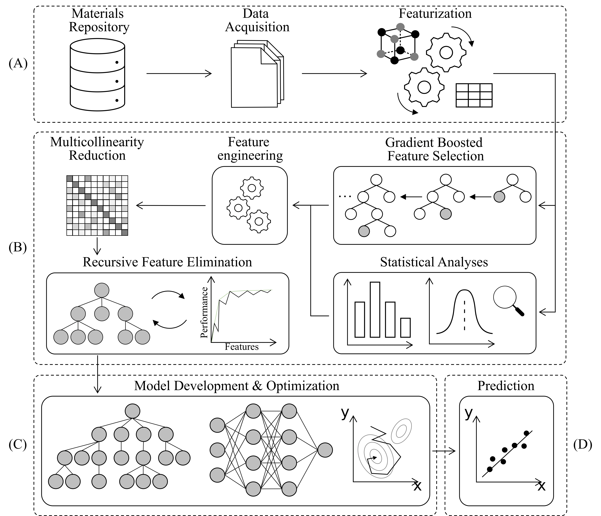

# GBFS4MPPML
Official implementation of "Gradient Boosted and Statistical Feature Selection Workflow for Materials Property Predictions"

By S. G. Jung, G. Jung & J. M. Cole

J. Chem. Phys. 159, 194106 (2023) </b> 
<a href="[https://pubs.acs.org/doi/10.1021/acs.jcim.0c00464](https://doi.org/10.1063/5.0171540)">Paper HTML</a>

## Introduction

The scripts herein are used to generate the results presented in the aforementioned paper. 

Jupyter Notebooks are provided along with the scripts. Their main purpose is to demonstrate the functionalities contained therein. 

For each property there are two Jupyter Notebooks: 

*(i) Featurize*

This notebook demonstrates the process of generating the features using various descriptors as mentioned in the corresponding manuscript. 
The descriptors we use are widely recognised and there are various ways one can generate these features. 
This step can be skipped if one already has a list of features they wish to use for their chemical data. 

*(ii) GBFS*

This notebook goes through the propose workflow as illustrated by the figure below. 
The approach we have taken is to use a pre-defined local path, where relevant data are stored and new data files are saved. See the provided Jupyter Notebooks as examples.
Each function requires pre-defined parameters, such as the name of target variable, a list of features, type of problem etc.

## Data

The data sets are available from: [![Table of Datasets]](https://hackingmaterials.lbl.gov/matminer/dataset_summary.html) 

## Workflow
The overview of the project pipeline:

## Acknowledgements
J.M.C. is grateful for the BASF/Royal Academy of Engineering Research Chair in Data-Driven Molecular Engineering of Functional Materials, which is partly sponsored by the Science and Technology Facilities Council (STFC) via the ISIS Neutron and Muon Source; this chair is supported by a PhD studentship (for S.G.J.). STFC is also thanked for a PhD studentship that is sponsored by its Scientific Computing Department (for G.J.).

## 🔗 Links

## License

